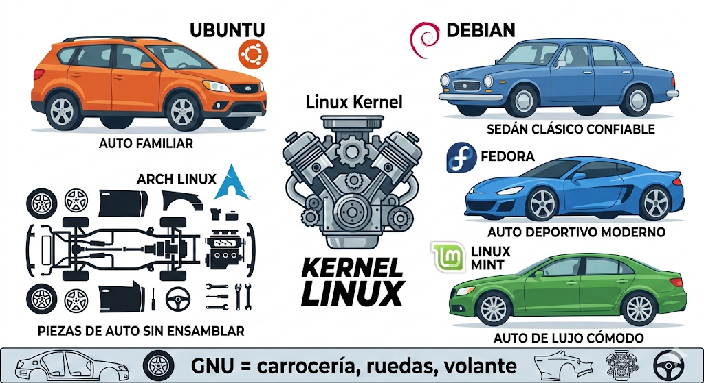

# ¿Qué es Linux?

## Conclusión clave
Linux **no es un sistema operativo completo**, es solo el **kernel** (núcleo).
El sistema operativo completo se llama **GNU/Linux**.

---

## La analogía del auto

| Parte del auto | Parte del sistema |
|---|---|
| Motor | **Linux** (kernel) |
| Carrocería, volante, frenos | **GNU** (herramientas y programas) |
| Auto completo funcionando | **GNU/Linux** (sistema operativo completo) |
| Marca o modelo del auto | **Distribución** (Ubuntu, Debian, Fedora...) |

---

## ¿Qué es el Kernel?
Es el **motor** del sistema. Se encarga de:
- Gestionar el hardware (RAM, CPU, disco)
- Gestionar los procesos
- Comunicar los programas con el hardware

---

## ¿Qué es GNU?
Son todas las **herramientas y programas** que rodean al kernel:
- Shell (la terminal)
- Compiladores
- Utilidades del sistema

Creado por **Richard Stallman** desde 1983.
Linux (el kernel) fue creado por **Linus Torvalds** en 1991.

---

## Distribuciones populares

| Distribución | Equivalente en auto | Enfoque |
|---|---|---|
| Ubuntu | Auto familiar fácil de manejar | Principiantes |
| Debian | Auto clásico y confiable | Estabilidad, servidores |
| Fedora | Auto deportivo moderno | Tecnología reciente |
| Linux Mint | Auto de lujo cómodo | Comodidad |
| Arch Linux | Piezas sin ensamblar, tú armas | Usuarios avanzados |

> Ubuntu está basado en Debian, y Linux Mint está basado en Ubuntu.
> Como modelos del mismo fabricante.

---

## Imagen de referencia

---

